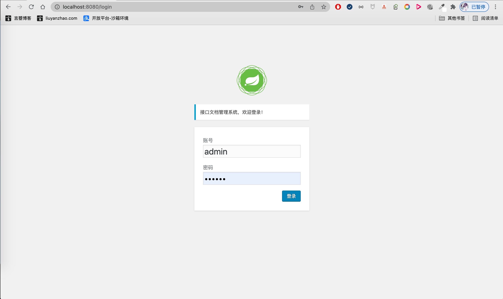
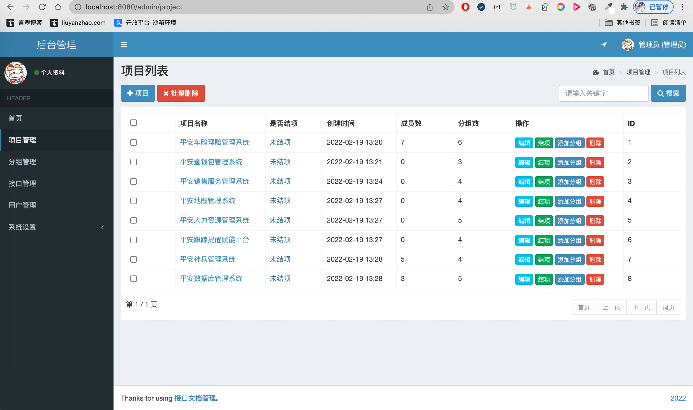
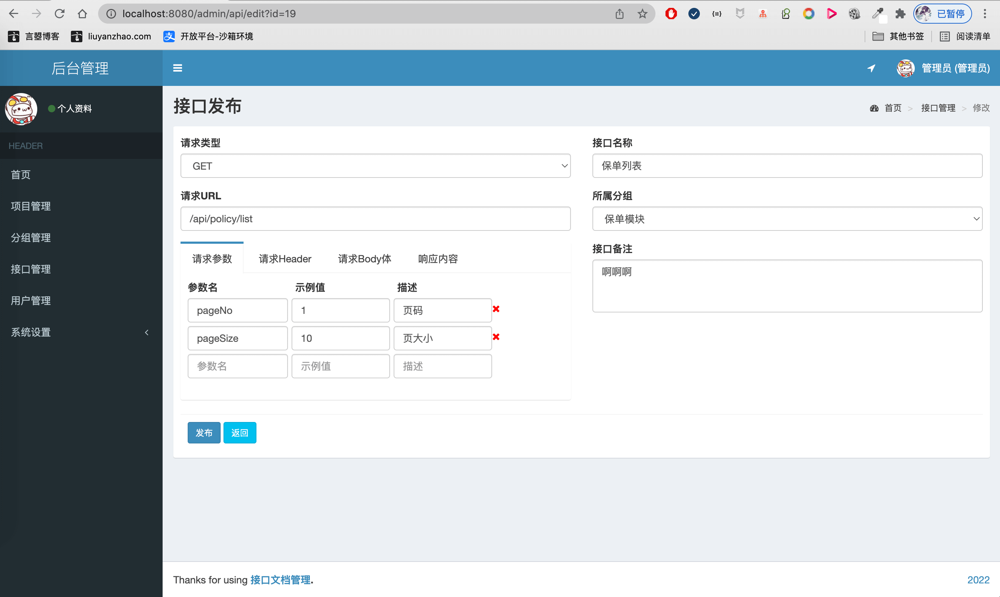
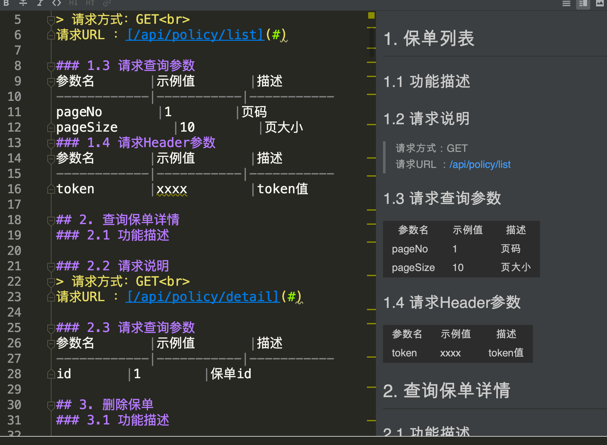
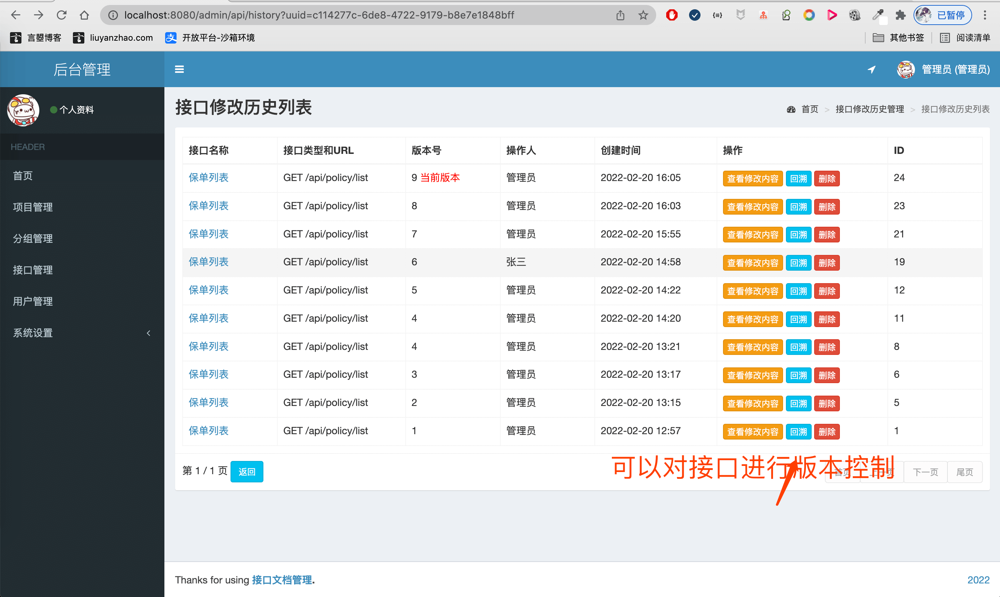
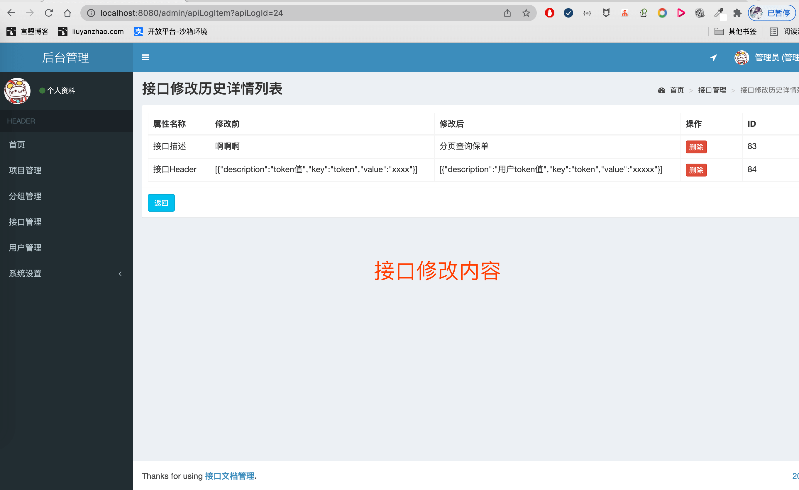
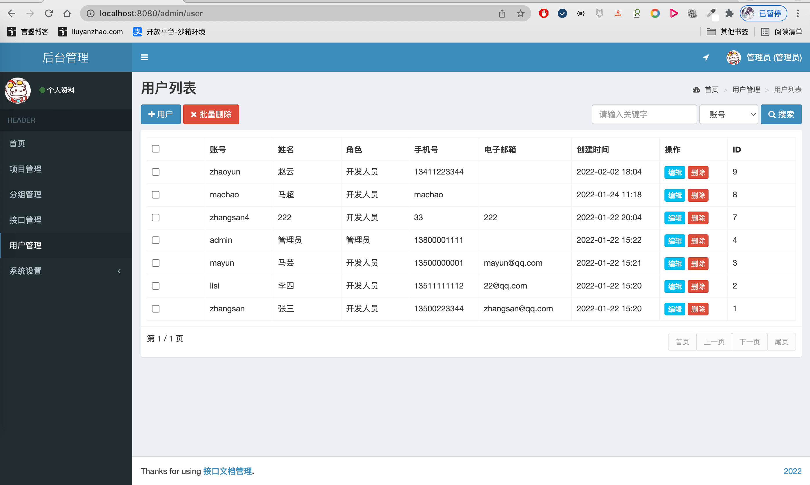
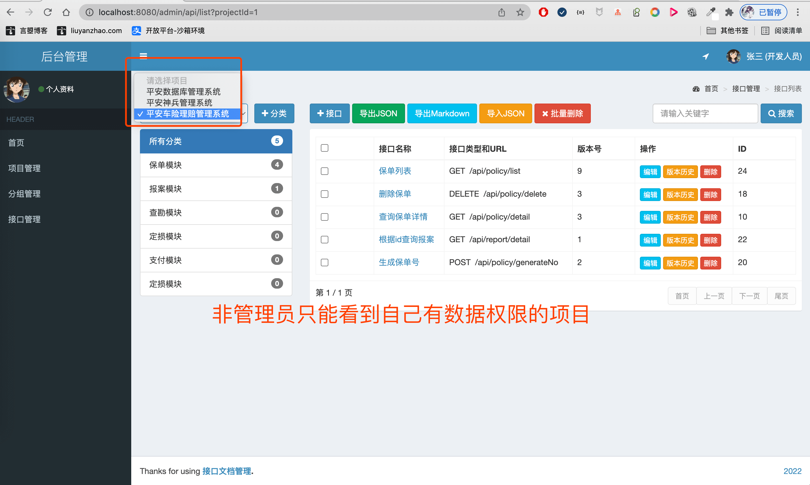

- 2022 基于SpringBoot的API文档管理系统
- 预览地址：[http://apisystem.liuyanzhao.com](http://apisystem.liuyanzhao.com) 
- 详细介绍地址：[https://liuyanzhao.com/shop/apisystem.html](https://liuyanzhao.com/shop/apisystem.html)
- 代码地址：https://github.com/saysky/apisystem 或 https://gitee.com/saysky/apisystem
- 完成时间：2022年2月

# 一、用户需求
## 1、文档录入管理，项目管理，分组管理，接口API管理
文档录入标准化，按项目->分组->接口进行管理。
- 项目管理：管理员新建项目，按项目的名称进行排序管理；维护修改项目，根据需求变动对项目进行后期修改；删除项目，删除多余的不需要的项目，保证系统总体的简便性，优化系统；项目结项，在管理员最终确定项目所有接口后，其他系统使用者无法再对项目所包含的分类、接口做改动。
- 分组管理：在项目里新建分组，同样可以进行删除分组，修改分组等等操作管理。
- 接口管理：系统操作者对接口文档进行基本操作，如新增、上传、删除等等。 

## 2、快速查询
文档按统一格式展示，并支持关键字快速查询。基于ElasticSearch全文搜索文档，利用分词器对将要搜索的数据进行分词处理，使用分词后的数据到索引库进行查询，将查询出的数据进行高亮处理。 

## 3、历史接口
可以查看某个接口所有的修改历史，包括接口修改的内容、修改人、修改时间等，能对历史接口进行回溯、版本控制。 

## 4、多方操作 
支持多用户同时对接口文档的操作。 

## 5、文档导出
导出markdown文档，导出带有文档地址跳转的详情界面，能显示文档的基本信息。 

## 6、用户管理，角色管理，权限管理
包括用户信息修改，如用户的名称，手机号等信息；新增用户，添加一名新用户，设置用户的初始化信息；删除用户，去除不需要的用户；用户权限分配， 给用户分配权限，让用户只能使用设定的功能。 

# 二、技术组成
- 1、SpringBoot 
- 2、MyBatis / MyBatis Plus
- 3、Thymeleaf
- 4、Bootstrap
- 5、MySQL

# 三、项目截图
1-登录页面.png

2-项目管理列表.png

3-项目编辑.png

4-分组管理.png

5-分组编辑.png

6-接口管理.png

7-接口管理-ES分词高亮.png

8-接口编辑.png

9-Markdown文档导出效果.png

10-接口修改历史.png

11-接口修改内容.png

12-用户管理.png

13-个人信息.png

14-角色管理.png

15-权限管理.png

16-非管理员的项目列表.png

17-非管理员的项目列表.png

18-非管理员的接口列表.png

# 四、联系方式
需要完整代码联系博主，微信847064370

